```mermaid
flowchart TD

    %% ─────────────────────────────────────────────
    %% 1. ONE-TIME SETUP
    %% ─────────────────────────────────────────────
    subgraph SETUP["① ONE-TIME SETUP  (run once before first use)"]
        direction LR
        A1([Start:\nFirst-time Setup])
        A2["oauth_setup.py\nPrint auth URL\nStart local redirect server on :8080"]
        A3[/"Browser:\nAuthorise Adobe Sign app\n& grant requested OAuth scopes"/]
        A4["Adobe Sign redirects with auth code\nExchange code → access + refresh tokens\nvia POST /oauth/v2/token"]
        A5[("refresh_token written\nto .env automatically")]
        A6["list_library_docs.py\nList all Library Document templates\nvia GET /libraryDocuments"]
        A7[("Copy ADOBE_SIGN_LIBRARY_DOC_ID\ninto .env")]
        A8([Setup Complete])

        A1 --> A2 --> A3 --> A4 --> A5 --> A6 --> A7 --> A8
    end

    %% ─────────────────────────────────────────────
    %% 2. ORCHESTRATOR
    %% ─────────────────────────────────────────────
    subgraph ORCH["② ORCHESTRATOR  —  orchestrator.py  (Windows Task Scheduler)"]
        direction LR
        B1[/"Windows Task Scheduler\nruns orchestrator.py daily / on demand"/]
        B2["Parse CLI arguments"]
        B3{"Mode?"}
        B4["action_send()\ncall bulk_sender"]
        B5["action_monitor()\ncall agreement_monitor"]
        B6["action_reminders()\ncall reminder_sender"]
        B7["action_status()\nPrint state file summary\nto stdout — no API calls"]

        B1 --> B2 --> B3
        B3 -->|"--send"| B4
        B3 -->|"--monitor  or  default"| B5
        B3 -->|"--reminders  or  default"| B6
        B3 -->|"--status"| B7
    end

    %% ─────────────────────────────────────────────
    %% 3. BULK SEND
    %% ─────────────────────────────────────────────
    subgraph SEND["③ BULK SEND  —  bulk_sender.py  /  sharepoint_reader.py"]
        direction TB
        C1["run_bulk_send()"]
        C2["sharepoint_reader.load_master_data()\nRead master Excel file from MASTER_DATA_PATH\nValidate required columns: partner_name, partner_email"]
        C3["Filter: skip rows where\ndate_sent column is already filled"]
        C4{"Any unsent\npartners?"}
        C5(["Nothing to send\nAll partners already have agreements"])
        C6["For each unsent partner\n(up to BATCH_SIZE if set)"]
        C7["build_merge_fields(partner)\nMap all Excel columns to\nAdobe Sign mergeFieldInfo format"]
        C8["client.create_agreement()\nPOST /agreements\nAdobe Sign REST API v6\nAttach library template + recipient + merge fields"]
        C9[("Append record to\nagreement_state.json\nstatus = OUT_FOR_SIGNATURE")]
        C10["try_update_excel_after_send()\nWrite date_sent + agreement_id\nback to master Excel via openpyxl"]
        C11["Sleep SEND_DELAY_SECONDS\n(default 2s — avoids rate limiting)"]
        C12(["Bulk Send Complete\nLog: sent / failed / skipped"])

        C1 --> C2 --> C3 --> C4
        C4 -->|No| C5
        C4 -->|Yes| C6 --> C7 --> C8 --> C9 --> C10 --> C11 --> C12
    end

    %% ─────────────────────────────────────────────
    %% 4. AGREEMENT MONITOR
    %% ─────────────────────────────────────────────
    subgraph MONITOR["④ AGREEMENT MONITOR  —  agreement_monitor.py"]
        direction TB
        D1["run_monitor()"]
        D2[("Load agreement_state.json")]
        D3["Filter: records with\nstatus = OUT_FOR_SIGNATURE"]
        D4{"Any pending\nagreements?"}
        D5(["Nothing to check\nExit"])
        D6["For each pending agreement"]
        D7["client.get_agreement(agreement_id)\nGET /agreements/{id}\nPoll current status from Adobe Sign"]
        D8{"Agreement\nstatus?"}
        D9["Update record:\nstatus = SIGNED / COMPLETED\nRecord completed_date (UTC)"]
        D10["Update record:\nstatus = CANCELLED / DECLINED\nLog for manual review"]
        D11["No change\nStill awaiting signature\ncheck again next scheduled run"]
        D12["Trigger response_processor\n.process_signed_agreement(agreement_id, name)"]
        D13[("Save updated\nagreement_state.json")]
        D14(["Monitor Complete\nLog: completed / cancelled / pending / errors"])

        D1 --> D2 --> D3 --> D4
        D4 -->|No| D5
        D4 -->|Yes| D6 --> D7 --> D8
        D8 -->|SIGNED / APPROVED / COMPLETED| D9 --> D12 --> D13
        D8 -->|CANCELLED / DECLINED / EXPIRED| D10 --> D13
        D8 -->|Other — still waiting| D11 --> D13
        D13 --> D14
    end

    %% ─────────────────────────────────────────────
    %% 5. RESPONSE PROCESSOR
    %% ─────────────────────────────────────────────
    subgraph RESPONSE["⑤ RESPONSE PROCESSOR  —  response_processor.py  (triggered by Monitor)"]
        direction TB
        E1["process_signed_agreement(agreement_id, partner_name)"]
        E2["client.get_form_data()\nGET /agreements/{id}/formData\nReturns list of field name/value dicts"]
        E3[("Save form data JSON\noutput/{name}_form_data_{timestamp}.json")]
        E4["client.get_documents()\nGET /agreements/{id}/documents\nList all documents on the agreement"]
        E5{"Excel\nattachments\nuploaded by signer?"}
        E6[("Download each Excel attachment\nSave raw bytes to output/")]
        E7[("Parse Excel → pandas DataFrame\nSave as CSV to output/")]
        E8["Log: no signer attachments found"]
        E9["client.download_combined_document()\nGET /agreements/{id}/combinedDocument\nFull audit-trail signed PDF"]
        E10[("Save signed PDF\noutput/{name}_signed_{timestamp}.pdf")]
        E11["try_update_excel_after_completion()\nSearch master Excel for matching agreement_id\nWrite date_received via openpyxl"]
        E12[("Mark processed = True\nin agreement_state.json")]
        E13(["Processing Complete\nLog: form data / attachments / PDF / errors"])

        E1 --> E2 --> E3 --> E4 --> E5
        E5 -->|Yes| E6 --> E7 --> E9
        E5 -->|No| E8 --> E9
        E9 --> E10 --> E11 --> E12 --> E13
    end

    %% ─────────────────────────────────────────────
    %% 6. REMINDER SENDER
    %% ─────────────────────────────────────────────
    subgraph REMINDERS["⑥ REMINDER SENDER  —  reminder_sender.py"]
        direction TB
        F1["run_reminders()"]
        F2[("Load agreement_state.json")]
        F3["Filter: OUT_FOR_SIGNATURE records only\n(skip completed / cancelled)"]
        F4["Acquire Microsoft Graph OAuth token\nMSAL ConfidentialClientApplication\nclient credentials flow"]
        F5{"Any pending\nagreements?"}
        F6(["Nothing due\nExit"])
        F7["For each pending agreement\nCalculate days since sent_date"]
        F8{"Days since\nsent?"}
        F9["client.get_signing_url()\nFetch live signing link\nfor day-7 chaser email"]
        F10["client.get_signing_url()\nFetch live signing link\nfor day-14 chaser email"]
        F11["client.get_signing_url()\nFetch live signing link\nfor day-30 chaser email"]
        F12["Send day-7 chaser email\nPOST /users/{mailbox}/sendMail\nMicrosoft Graph API"]
        F13["Send day-14 chaser email\nPOST /users/{mailbox}/sendMail\nMicrosoft Graph API"]
        F14["Send day-30 chaser email\nPOST /users/{mailbox}/sendMail\nMicrosoft Graph API"]
        F15[("Set reminder_7_sent = True\nin state.json")]
        F16[("Set reminder_14_sent = True\nin state.json")]
        F17[("Set reminder_30_sent = True\nin state.json")]
        F18[("Save agreement_state.json")]
        F19(["Reminders Complete\nLog: sent / skipped / errors"])

        F1 --> F2 --> F3 --> F4 --> F5
        F5 -->|No| F6
        F5 -->|Yes| F7 --> F8
        F8 -->|">= 7 days & not yet sent"| F9 --> F12 --> F15 --> F18
        F8 -->|">= 14 days & not yet sent"| F10 --> F13 --> F16 --> F18
        F8 -->|">= 30 days & not yet sent"| F11 --> F14 --> F17 --> F18
        F18 --> F19
    end

    %% ─────────────────────────────────────────────
    %% CROSS-SECTION LINKS
    %% ─────────────────────────────────────────────
    A8 -.->|"prerequisite — run once"| B1
    B4 --> C1
    B5 --> D1
    B6 --> F1
    D12 --> E1
```

# PSTN Migration — Adobe Sign Automation — Process Map (Mermaid)

Paste the code block below into **https://mermaid.live** or **mermaid.ai**
then export as PNG / SVG for Lucidchart import, or copy direct.

---

---

## Shape Key

| Shape | Meaning |
|---|---|
| `([text])` | Start / End terminal |
| `[text]` | Process / action step |
| `[/text/]` | External system / manual action |
| `{text}` | Decision / branch |
| `[(text)]` | Data store / file written |
| `-.->` | Prerequisite / indirect link |
